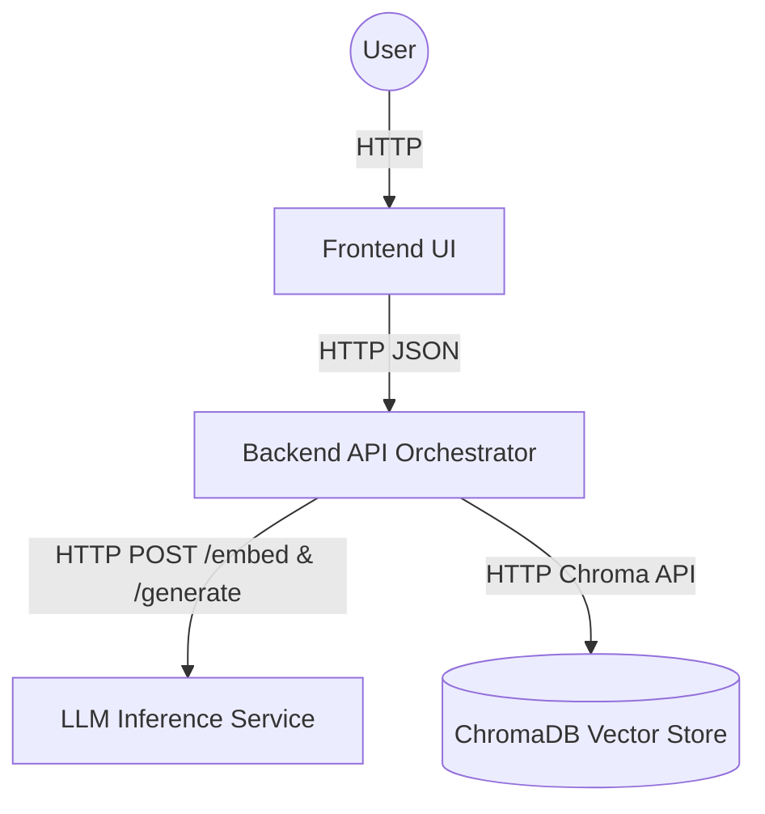

# Semantic Code Search Engine

This project enables you to "talk" directly to a Python codebase using natural language. It ingests a compressed repository archive (`.zip` or `.tar` or `.tar.gz`), unpacks the AST to contextually chunk classes and methods, calculates local dense embeddings, and exposes a ChatGPT-style conversational UI to find logic seamlessly.

## Architectural Clarity

> **Note:** The application was recently refactored from a monolithic 2-container setup into a clean **4-container microservice architecture**. This split was enacted strictly for structural clarity and modular scaling, proving that the orchestrator API layer remains devoid of dense Machine Learning binaries and local database states. Despite the professional-grade decoupling, running the environment locally remains remarkably simple.

### Architecture Decision: "Why 4 Containers?"
While a 2-container layout technically achieves the home-assignment requirements seamlessly, binding stateful persistent storage (ChromaDB) and massive 1.1B parameter Large Language Models (TinyLlama) physically within the native Python memory space of a volatile API pipeline ultimately compromises horizontal scaling and local RAM footprint. 
By cleanly separating the Database (`chroma`) and inference logic (`llm-inference`) behind explicit generic HTTP adapters, the `backend-api` acts as a pure execution orchestrator. This demonstrates standard production topography while leveraging simplistic local proxies that remain strictly lightweight enough for generic review execution.

### Service Requirements

1. **Frontend**: The UI only (TypeScript UI).
2. **Stateless API**: FastAPI orchestration API running pure HTTP routes. Does *not* download or embed Hugging Face models natively.
3. **Chroma Server**: Dedicated database persistence environment operating the structural intelligence maps via internal API networking.
4. **LLM Inference Server**: Disconnected compute cluster designed strictly for loading, batching and processing large dense ML graphs (Jina + TinyLlama parameters).

### Service Diagram


## Getting Started

To ensure a reviewer-friendly experience, deployment is abstracted securely behind standard Make targets.

### Prerequisites
- Docker & Docker Compose
- Make

### Execution (2 Commands)

```bash
# 1. Build the microservices cluster
make build

# 2. Boot the topology sequentially in the background
make up
```
The application will safely spin up. Open your browser to **http://localhost:5173** to reach the UI portal!

### Environment Variables
Configuration is driven gracefully via Docker Compose:
- `CHROMA_HOST` / `CHROMA_PORT` / `COLLECTION_NAME`: Connects the backend purely to the vector space.
- `LLM_BASE_URL`: URL mapping the backend to the `llm-inference` cluster endpoints (Default: `http://llm:8002`).
- `EMBEDDING_MODEL_NAME`: HuggingFace AST Jina model mapped strictly to the inference module.
- `LLM_MODEL_NAME`: Remote target mapped to TinyLlama conversational synthesis module.

## Architecture & Troubleshooting

**First-Time Boot Latency (Model Downloading):**
The `llm-inference` container downloads the `TinyLlama` (1.1 Billion parameter) language model and the `Jina` embeddings dynamically upon its first task execution (the first time you upload an archive or trigger a search). This can take several minutes based on internet speeds. 

**Wait for logs:** If the UI reports an error or times out instantly, check the inference download progress by tailing the logs:
```bash
make logs
```

The downloaded models will dynamically persist out to your host using the `semanticsearchengine_llm_cache` volume, guaranteeing lightning-fast cached boots upon subsequent `make up` commands.

### Useful Commands
- `make logs`: Stream container cluster traces.
- `make down`: Halt the stack safely.
- `make clean`: Erase all container states, image orphans, and clear vector and model cache named volumes securely.
- `make backend-shell`: Secure bash drop into the API backend.
