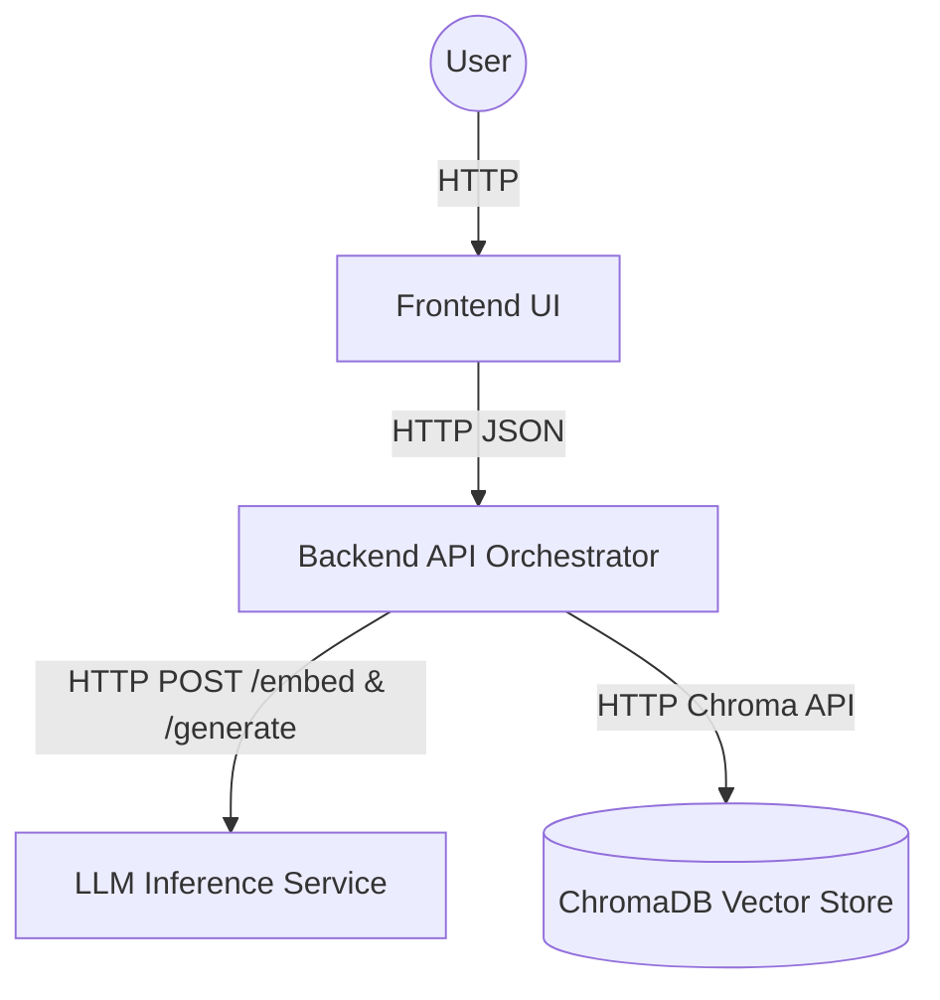

# Semantic Code Search Engine

"Semantic Search Engine" is a tool that allows you to "talk" directly to a Python codebase using natural language. 

It ingests a compressed repository archive (`.zip`, `.tar`, or `.tar.gz`), parses the Abstract Syntax Tree (AST) to extract classes and methods, calculates local dense embeddings, and exposes a ChatGPT-style conversational interface to help you search and understand the code seamlessly.

## How it Works

The application interacts via a fully decoupled microservice architecture:

1. **Frontend**: A React/TypeScript web app providing the conversational UI and file upload portal.
2. **Backend API**: A FastAPI orchestration service that receives files, chunks code dynamically via Tree-sitter, and orchestrates searches without holding state.
3. **Vector Database**: A ChromaDB server that persistently stores the AST embeddings.
4. **LLM Inference**: A dedicated Python service running local Hugging Face text-generation (`TinyLlama`) and sentence embedding (`Jina`) models efficiently using PyTorch.

## Semantic Chunking with Tree-sitter

Unlike naive line-based chunkers, this engine uses **Tree-sitter** to parse the Abstract Syntax Tree (AST) of Python files. This allows the system to:
- Identify exact boundaries of classes and functions.
- Retain context by mapping code blocks to their logical parents.
- Filter out comments and boilerplate effectively to maximize the LLM's context window efficiency.

### Architecture Flow



## Getting Started

### Prerequisites
- Docker & Docker Compose
- Make

### Quick Start

Booting the entire application is simple. From the root of the repository, simply run:

```bash
make up
```

This single command will automatically build the necessary Docker images, spin down any old layers, and start the 4-container cluster sequentially in the background.

Once booted, open your browser and navigate to:
**http://localhost:5173**

### Test application
Under `dataset` directory you can find a 'Vampi' - a Python project as zip/tar/gz file of a python project. Upload it to the application and ask questions about the code.
In addition to that, use LightRAG zip for a large repository (76,391 lines in .py files)

### Environment Configuration

Configuration is passed through Docker Compose implicitly, mapping the services:
- `CHROMA_HOST` / `CHROMA_PORT` / `COLLECTION_NAME`: Connects the API to the Chroma vector space.
- `LLM_BASE_URL`: Maps the API natively to the Inference container.
- `EMBEDDING_MODEL_NAME`: Defaults to `jinaai/jina-embeddings-v2-base-code`.
- `LLM_MODEL_NAME`: Defaults to `TinyLlama/TinyLlama-1.1B-Chat-v1.0`.

## Notes on First-Time Launch

**Model Downloading:**
The `llm-inference` container downloads the language and embedding models dynamically upon its first task execution (the first time you upload an archive or trigger a search). This can occasionally take a few minutes based on your network speed.

If the UI ever times out during the very first search, simply check the download progress by tailing the logs:
```bash
make logs
```

The downloaded models persist safely onto a Docker Volume (`semanticsearchengine_llm_cache`), guaranteeing lightning-fast cached boots upon any subsequent `make up` executions.

## Useful Commands

- `make up`: Build and boot the stack.
- `make logs`: Stream all container logs.
- `make down`: Halt the stack safely.
- `make clean`: Erase all container states and clear vector/model cache named volumes.
- `make backend-shell`: Drop into a secure bash shell inside the API backend.
